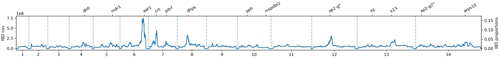

# hmmibd-rs-bench-empirical

This repository uses MalariaGEN Pf7 data to demonstrate the usage of `hmmibd-rs`
for accelerating IBD detection in large datasets.

The following notes provide guidance on using the repository.

## Clone the Repository
```sh
git clone https://github.com/bguo068/hmmibd-rs-bench-empirical.git
cd hmmibd-rs-bench-empirical  
```

## Software Installation

1. **Nextflow**: Install the Nextflow workflow engine by following the detailed
guide [here](https://www.nextflow.io/docs/latest/install.html).

2. **Rust**: Rust is required for the tools mentioned below. Install it by
following the instructions provided [here](https://www.rust-lang.org/tools/install).

3. **hmmibd-rs**: Used to call IBD segments.

```sh
git clone https://github.com/bguo068/hmmibd-rs.git
cd hmmibd-rs
cargo build --release
cp target/release/hmmibd-rs ../bin/
cd ..
```

4. **ibdutils and genomeutils**: Used for calculating IBD coverage.

```sh
git clone https://github.com/bguo068/ishare.git
cd ishare
cargo build --release --bin ibdutils
cargo build --release --bin genomeutils.rs
mkdir ../bin
cp target/release/ibdutils ../bin/
cp target/release/genomeutils ../bin/
cd ..
```

## Prepare Input Data
1. Download RAW VCF files from MalariaGEN Pf7. Refer to the notes in 
`input/Readme.md`. Download time may vary based on multiple factors.

2. Prefilter the downloaded BCF data. Refer to the notes in 
`input/pre_filt_bcf.sh` to remove variants with low quality, 
high per-site missingness, and sites that only contain indels.

## Run the Pipeline
```sh
# You can create any folder you want. It is recommended to separate the
# Nextflow pipeline folder from the pipeline running folder.
cd runs/r240826/

# This will launch Nextflow using local compute resources.
bash 01_run.sh
```

**Note**:

1. To configure SGE or SLURM (instead of the local compute executor) or to adjust CPU/RAM resources, modify the `nextflow.config` file. Detailed instructions can be found [here](https://www.nextflow.io/docs/latest/executor.html#sge).

2. Control the behavior of hmmibd-rs in processing BCF by modifying the config file. The pipeline uses `input/bcf_filter_config.toml` by default. Refer to the [`hmmibd-rs`](https://github.com/bguo068/hmmibd-rs.git) repository for details on configuration tuning.

## Analyze IBD Results

Several methods exist to analyze IBD data. This pipeline includes IBD coverage
calculation and serves as an example of downstream IBD-based analysis. The
following script visualizes the IBD coverage.

```sh
# Given that matplotlib, numpy, and pandas are installed
python 02_analyze_cov.py
```
This will generate the following plot:


